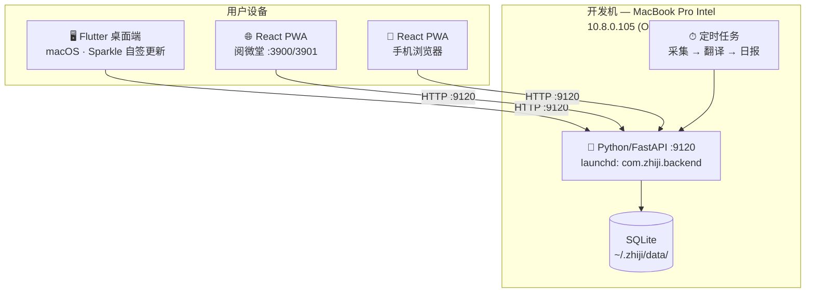

# 知几 — 架构全景

> 本文档是知几项目的"宪法"——架构、规范、发布流程、踩坑记录的权威来源。人和 AI 共同参考。

---

## 产品定义

知几是一套**个人知识情报系统**，覆盖"采集→翻译→分析→沉淀"全链路，三端一服务协同。

| 端 | 技术 | 定位 |
|---|---|---|
| macOS 桌面 | Flutter + Sparkle 自动更新 | 主战场，14 页深度操作 |
| Web 浏览器 | React PWA（阅微堂，:3900/3901） | 桌面浏览器访问，同一套代码 |
| 手机浏览器 | React PWA（同上） | 响应式，手机快速查看 |
| 后端服务 | Python/FastAPI | 数据采集、翻译、日报，开发机常驻 |

> **Flutter Web** 已编译成功，但暂不部署。`dart:io`/`window_manager` 等桌面 API 需 `kIsWeb` 守卫，且无响应式（桌面尺寸 1440px）。Web/移动端走 React PWA 是主力。

---

## 架构全景图



**部署方式：**

```
开发机 (10.8.0.105)
├── Python/FastAPI 后端 :9120
│   └── launchd: com.zhiji.backend（开机自启）
├── SQLite: ~/.zhiji/data/intelligence.sqlite
├── Hermes cron 定时任务
│   ├── 每 6h: 事件采集 + 翻译 + 即时快报
│   └── 每日 8:00: 深度日报
└── React PWA 阅微堂 :3900/3901

MacBook Air (10.8.0.21, Apple Silicon)
└── Flutter 桌面端
    ├── Sparkle 自动检查更新
    ├── 默认指向开发机后端
    └── 系统设置页可切换后端地址
```

---

## 各端规格

### 后端 — Python/FastAPI

| 项 | 值 |
|---|---|
| 路径 | `/Users/mrh/Documents/Projects/zhiji` |
| 入口 | `src/zhiji_backend/` |
| 端口 | `9120` |
| 守护 | `com.zhiji.backend`（launchd） |
| 数据库 | SQLite，`~/.zhiji/data/intelligence.sqlite` |
| 版本号 | `src/zhiji_backend/__init__.py` → `__version__` |
| 分发 | `pip install <whl>`，GitHub Releases |

**常用命令：**
```bash
sudo launchctl list com.zhiji.backend        # 查看状态
sudo launchctl bootstrap system /Library/LaunchDaemons/com.zhiji.backend.plist  # 启动
sudo launchctl bootout system /Library/LaunchDaemons/com.zhiji.backend.plist    # 停止
zhiji update --check                          # 检查后端更新
zhiji version                                 # 查看版本
```

### 桌面端 — Flutter macOS

| 项 | 值 |
|---|---|
| 路径 | `desktop/` |
| SDK | `/Users/mrh/flutter/bin/flutter` |
| 版本号 | `desktop/pubspec.yaml` → `flutter build` 写入 Info.plist |
| 最小窗口 | 1440×700 |
| 内容宽度 | 最大 1152px |
| 自动更新 | Sparkle 2 + 自签证书 `Zhiji`，零弹窗 |
| 分发 | DMG（通用二进制 x86_64 + arm64），GitHub Releases |

**编译：**
```bash
export PATH="/Users/mrh/flutter/bin:$PATH"
cd desktop && flutter build macos
```

**注意：** `flutter clean` 清空 `build/`，需全量重编约 10 分钟。`--skip-build` 时 Info.plist 可能仍是旧版本号。

### Web / 移动端 — React PWA（阅微堂）

| 项 | 值 |
|---|---|
| 路径 | `/Users/mrh/Documents/Projects/reading` |
| 端口 | 开发 `:3900`，生产 `:3901` |
| 技术栈 | React + Vite + Tailwind |
| 响应式 | 自适应桌面/平板/手机 |
| 定位 | web 浏览器 + 手机浏览器主力方案 |

### Flutter Web（备选/实验性）

已可编译，产物 `desktop/build/web/`（41MB），但存在限制：
- `dart:io` / `window_manager` / `Platform` 全需 `kIsWeb` 守卫
- 无响应式设计，桌面尺寸 1440px
- 不替代 React PWA

---

## 版本与发布

### 版本号规则

两处必须同步主版本号（X.Y.Z）：

| 端 | 文件 | 格式 |
|---|---|---|
| 后端 | `src/zhiji_backend/__init__.py` | `__version__ = "X.Y.Z"` |
| 桌面端 | `desktop/pubspec.yaml` | `version: X.Y.Z+N` |

### 发版命令

```bash
# 一键发版（推荐）
./scripts/release.sh 1.10.0

# 仅服务端
./scripts/release.sh 1.10.0 server

# 仅桌面端
./scripts/release.sh 1.10.0 desktop

# 仅构建 DMG（不发 GitHub）
cd desktop && flutter build macos
python3 scripts/build_release.py
```

### 更新机制

| 端 | 方式 | 说明 |
|---|---|---|
| 后端 | `zhiji update` CLI | 从 GitHub API 检查 → 下载 whl → pip install → 重启 |
| 桌面端 | Sparkle 2 | 启动自动检查 appcast.xml → 下载 DMG → EdDSA 验证 → 替换安装 |

> 🚫 **bsdiff/bspatch 增量更新已废弃**：国内 GitHub 下载不可靠，补丁文件字节级损坏导致 SIGSEGV 崩溃。改为 Sparkle 全量 DMG 更新。

### 自签证书

- 证书名 `Zhiji`，类型代码签名
- 开发机（Intel MBP）和日常机（Apple Silicon MBA）各导入一次 `.cer`
- 钥匙串选「登录」，设为「始终信任」
- 免费替代 Apple Developer ID（$99/年）

---

## 开发环境

| 项 | 值 |
|---|---|
| 开发机 | MacBook Pro Intel，OpenVPN 10.8.0.105 |
| Flutter SDK | `/Users/mrh/flutter/bin/flutter` |
| Python venv | 项目目录下 `.venv/` |
| 数据目录 | `~/.zhiji/`（开发机 symlink → 项目 `data/`） |
| Git 仓库 | `https://github.com/samuelhung/ki` |

---

## Skills 清单

| Skill | 职责 | 触发条件 |
|---|---|---|
| `zhiji` | 项目开发约定、架构、UI 规范、踩坑速查 | 改代码前，了解项目 |
| `zhiji-release-workflow` | 版本号同步、构建、签名、GitHub Release 全流程 | 发版、打包、更新 |

**边界：** 前端/后端功能开发找 `zhiji`，发版/版本号/构建找 `zhiji-release-workflow`。

---

## 注意事项

### 🔴 致命（做了会挂）

| # | 坑 | 说明 |
|---|---|---|
| 1 | 签名两步法 | 重签名前必须 `--remove-signature` 再 `--sign -`，直接签报 strict validation |
| 2 | launchd 命令 | macOS 15+ 用 `sudo launchctl bootstrap`，**不是** `load` |
| 3 | 版本号同步 | 改 `__init__.py` 必须同步改 `pubspec.yaml`，否则桌面端版本检测错乱 |
| 4 | Flutter Web 守卫 | `dart:io`/`window_manager`/`Platform` 全需 `kIsWeb` 守卫，否则白屏 |

### 🟡 易错（会浪费半小时排查）

| # | 坑 | 说明 |
|---|---|---|
| 5 | DMG 文件名 | 必须纯 ASCII（`zhiji_X.Y.Z.dmg`），GitHub 会上传但吞掉中文字符 |
| 6 | `flutter clean` | 清空 `build/` 需全量重编约 10 分钟 |
| 7 | `--skip-build` | Info.plist 可能仍为旧版本号，先确认 `flutter build macos` 已跑 |
| 8 | 自签证书导入 | 双击 `.cer` 导入钥匙串必须选「登录」，其他钥匙串 Sparkle 可能找不到 |
| 9 | Release `--latest` | 先发旧版再发新版后，旧版会被标为 Latest，需 `gh release edit vX.Y.Z --latest` |
| 10 | Sparkle CLI 不入库 | ~5MB，`git push` 会 HTTP 400 被拒，已加 `.gitignore` |

### 🟢 惯例（记住省时间）

| # | 项 | 说明 |
|---|---|---|
| 11 | 最小宽度 | 桌面端 1440px |
| 12 | 内容宽度 | 最大 1152px |
| 13 | 配色 | 主背景 `#0B0C10`、面板 `#141518`、边框 `#2A2B30` |
| 14 | Dart 代码 | 不写单行，保持正常换行缩进 |
| 15 | 改动后验证 | 每次功能性改动后 bump 版本号 + changelog + 更新系统说明页 |
| 16 | GitHub Release 图标 | 每个大标题前加 emoji（🔐 安全、✨ 新功能、🐛 修复、🎨 UI 等） |
| 17 | 版本号标记 | 发版后 UI 上显示版本号，方便肉眼确认当前版本 |

---

## 历史决策记录

| 决策 | 原因 |
|---|---|
| 弃用 bsdiff 增量更新 | 国内 GitHub 下载不可靠，补丁损坏导致 SIGSEGV |
| 弃用 Tauri | 改为 Flutter 获得更好的 macOS 原生体验 |
| 自签证书替代 Developer ID | 免费，两台 MacBook 信任即可 |
| Flutter Web 暂不部署 | 无响应式，移动端走 React PWA |
| React PWA 统一 web/移动端 | 一套代码，响应式适配所有屏幕 |

---

> 最后更新：2026-06-24
